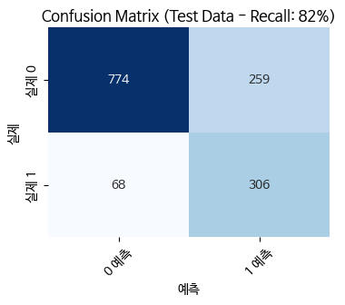
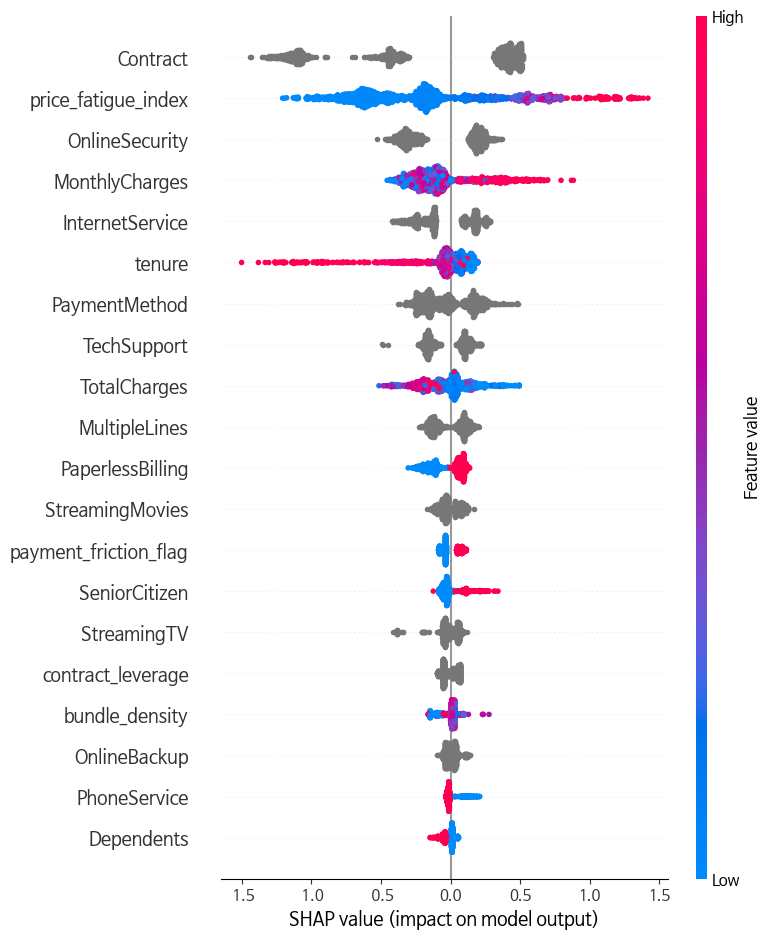
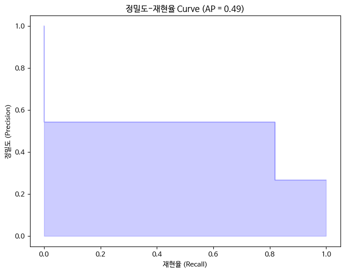
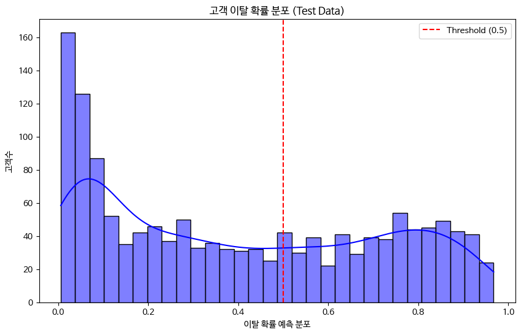
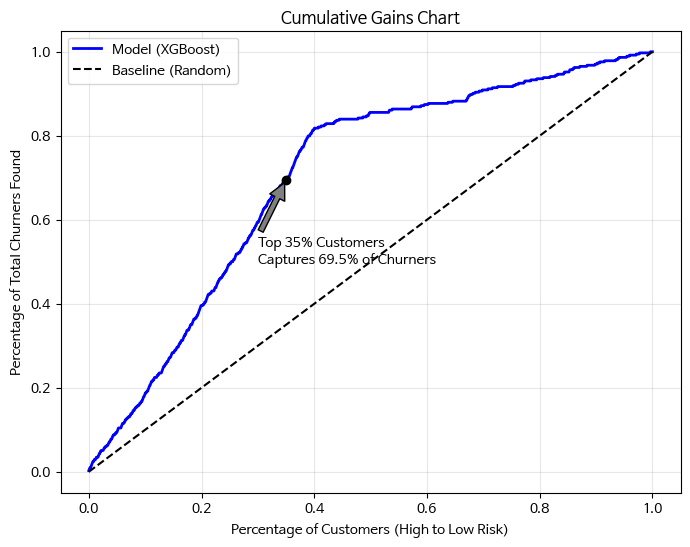

# IBM Telco Churn Prediction: High-Recall ML Pipeline
[](https://ibm-customer-churn-prediction-ml.streamlit.app/)

## 프로젝트 개요 (Overview)
본 프로젝트는 **82%의 높은 재현율 (Recall)**을 달성하여 실제 이탈 고객을 선제적으로 식별하는 엔드-투-엔드 머신러닝 파이프라인 프로젝트입니다. 단순한 모델 학습을 넘어, BigQuery 데이터 통합, SQL 활용한 6가지 비즈니스 맞춤형 피처 엔지니어링, 그리고 SHAP을 활용한 모델 해석성 (Explainability/XAI) 확보에 집중했습니다.

## 주요 성과 및 차별점 (Model Performance & Key Differentiation)
기존 학술 연구 및 산업계 [벤치마크](https://www.kaggle.com/code/kaanboke/xgboost-lightgbm-catboost-imbalanced-data#SHAP-Summary-Plot--XGBoost-(with-adjusted-Scale_Pos_Weight-=-5)) (SOTA 2024-2025 기준) 대비 이탈자 예측 능력을 혁신적으로 개선했습니다.

|Metric|Industry Baseline|**My Model**|Improvement|
|-|-|-|-|
|**Recall**|74%|**82%**|**+8%p (Significant Improvement)**|
|**Precision**|53%|**54%**|비슷함|
|**Accuracy**|75%|**78%**|+3%p (Slight Improvement)|

본 모델의 모든 성능 지표는 과적합(Overfitting)을 배제하기 위해 학습 시 전혀 사용되지 않은 **최종 테스트 데이터셋(20%)**을 바탕으로 산출되었습니다. 전체 데이터셋 기준 83% 대비 소폭 하락했으나, 이는 실전 환경에서의 객관적인 예측 성능을 반영한 결과입니다.
 
- **성과:** 실제 비즈니스 환경과 동일한 불균형 데이터(Imbalanced Data) 기반에서 **Recall 82%**를 달성했습니다.
- **차별점:** 많은 기존 벤치마크 모델들이 SMOTE와 같은 오버샘플링 기법을 통해 수치를 인위적으로 높이는 것과 달리, 본 모델은 **원본 데이터의 특성을 그대로 유지**하며 **SQL 기반의 피처 엔지니어링과 XGBoost 하이퍼파라미터 최적화**만으로 성능을 끌어올렸습니다.
- **비즈니스 가치:** **Precision(54%) 대비 높은 Recall(82%)을 확보**함으로써, 이탈 가능성이 높은 고객을 최대한 놓치지 않고 포착하여 **리텐션 비용 효율을 극대화**하는 데 중점을 두었습니다.

---

## 프로젝트 요약: 7,043명의 통신사 고객 데이터를 바탕으로 이탈 위험도를 예측하고, BigQuery와 Streamlit을 활용하여 실시간 방어 전략을 제안하는 엔드 투 엔드(End-to-End) 데이터 사이언스 프로젝트입니다.

### 0. 🥅 비즈니스 배경 (Business Context)
- 배경: 통신 산업은 신규 고객 유치 비용(CAC)이 기존 고객 유지 비용보다 월등히 높아, 선제적인 이탈 방지가 수익성에 직결됩니다.
- 목표:
  - 고객의 이탈 여부를 80% 이상의 재현율(Recall)로 예측.
  - 비즈니스 담당자가 즉각 활용 가능한 인터랙티브 의시결정 도구 구축.
  - 데이터 엔지니어링(SQL)부터 배포(Web App)까지의 전체 파이프라인 검증.

### 1. 🛠 기술 스택 (Tech Stack)
- **Data Engineering:** Google Cloud Platform (BigQuery SQL)
- **Analysis & Modeling:** Python, Pandas, Numpy, XGBoost, Scikit-learn, SHAP, Matplotlib, Seaborn
- **Deployment:** Streamlit (Cloud Hosting)
- **Validation:** `Stratified K-Fold Cross-Validation`, `RandomizedSearchCV`

### 2. ⚙️ 핵심 프로세스 (Workflow)
#### 🧠 Phase 1: Feature Engineering (The "Difference Maker")
단순 원본 데이터 사용이 아닌, 시스템 엔지니어링적 관점에서 도메인 지식을 반영하여 이탈의 핵심 원인을 수치화한 6가지 파생 변수를 SQL로 직접 생성했습니다.

|피처명|정의 및 공식|비즈니스 로직|
|-|-|-|
|Price Fatigue Index|$MonthlyCharges / Tenure$|가입 기간 대비 요금 부담도. 충성도 대비 비용 민감도를 포착.|
|Contract Leverage|계약 형태 (Month-to-Month) + 요금 수준 결합|언제든 떠날 수 있는 고액 결제 고객 식별.|
|Bundle Density|사용 중인 총 서비스 개수|서비스 결합도(Stickiness) 측정. 결합도가 낮을수록 이탈 위험 상승.|
|Payment Friction Flag|전자 수표(Electronic Check) 사용 여부|결제 방식의 불편함 또는 연체 가능 성과 이탈의 상관관계 반영.|
|Overpaying Flag|그룹 내 평균 대비 초과 요금 여부|고객이 느끼는 상대적 불공정성 수치화.|
|Unbalanced Bundle|고가 요금제 - 보안/기술지원 미포함|서비스 가치 불균형 상태 식별.|

#### Phase 2: 모델링 및 성능 최적화
- **알고리즘:** 데이터셋 규모(7,043행)에 최적화된 XGBoost 선택 (과적합 Overfitting 방지 및 안정성 확보).
- **클래스 불균형 해결:** 이탈 고객 비율(약 26%)을 고려하여 scale\_pos\_weight 적용 및 Stratified K-Fold 교차 검증 수행.
- **성과:** Recall(재현율)을 baseline 대비 약 12% 향상시켜 실제 이탈자를 놓칠 위험을 최소화함.

#### Phase 3: 대시보드 구현 (Streamlit)
모델 결과를 시각화하고, 예측된 확률값에 따라 이탈 위험 등급 제공하고 SHAP(XAI) 기반 차등화된 비즈니스 액션을 제안하도록 실시간 대시보드를 설계했습니다.

### 3. 📊 핵심 시각화 분석 및 인사이트 (Core Visualizations & Insights)
*모든 시각화는 모델이 학습 시 보지 못한 **Test Dataset(전체의 20%)**을 기반으로 생성되어, 실전 환경에서의 객관적인 성능을 담보합니다.*

### 1. 모델 성능 검증 (Confusion Matrix)

- **인사이트:** 실제 이탈 고객을 놓치지 않고 잡아내는 **재현율(Recall) 82%**를 달성했습니다. 이는 이탈 징후가 있는 고객 10명 중 8명을 선제적으로 식별할 수 있음을 의미하며, 비즈니스 손실 방어를 위한 강력한 기초 지표가 됩니다.

### 2. 피처 기여도 분석 (Feature Attribution)

- **인사이트:** 모델은 **약정 형태(Contract)**와 SQL로 생성한 **가입 기간 대비 요금 부담도(Price Fatigue Index)**를 가장 중요한 이탈 원인으로 지목합니다. 특히 월별 계약(Month-to-month) 여부와 가입 기간 대비 높은 요금이 이탈 확률을 급격히 높이는 양(+)의 상관관계를 시각적으로 증명합니다. 배포된 대시보드에서 개별 고객 단위의 이탈 원인 개인화(Personalized Churn Drivers)해서 제공하도록 SHAP 기반 제안을 `app.py`에서 적용했습니다.

### 3. 정밀도-재현율 곡선 (Precision-Recall Curve)

- **인사이트:** AP = 0.49를 기록하며, 불균형 데이터 환경에서도 무작위 예측 대비 월등히 높은 타겟팅 정확도를 유지합니다. Recall 82% 지점에서도 모델의 신뢰도가 급격히 무너지지 않음을 시각적으로 증명합니다.

### 4. 이탈 위험도 분포 (Churn Risk Distribution)

- **인사이트:** 이탈 확률이 낮은 구간(0~0.2)에 고객이 밀집되어 있어 안전군 식별이 매우 안정적입니다. 반면 고위험군은 특성이 명확히 구분되어 나타나므로, 마케팅 리소스를 집중해야 할 소수 타겟을 정교하게 추출하는 데 최적화되어 있습니다.

### 5. 누적 이익 차트 (Cumulative Gains Chart)

- **인사이트: 비즈니스 타겟팅 효율성 증명:** 위험 점수 기준 상위 **35%의 고객군**을 집중 관리하는 것만으로도 **전체 이탈자의 약 70%**를 선제적으로 식별할 수 있습니다. 이는 무작위 타겟팅 대비 약 2배 이상의 효율을 보이며, 한정된 마케팅 예산으로 방어 성공률을 극대화할 수 있는 데이터 기반의 의사결정 근거가 됩니다.

### 4. 💡 Troubleshooting, Lessons Learned, & Core Technical Challenges
- 데이터 불균형 문제: 단순 정확도(Accuracy)만 높고 이탈자를 맞추지 못하는 문제를 scale\_pos\_weight 파라미터 튜닝을 통해 해결하며 성능 지표 선택의 중요성을 학습함.
- 클라우드 연동: BigQuery API를 Python 환경과 연동하며 엔터프라이즈급 데이터 처리 워크플로우를 경험함.
- **Recall의 한계 돌파 (The 74% Recall Ceiling)**
  - 기존 피처만으로는 Recall이 74%에서 정체되는 구간이 발생했습니다. 고객이 '가입 기간 대비 요금 상승'에 민감하다는 가설을 세우고 **Price Fatigue Index**를 직접 설계하여 중요 변수로 활용, Recall을 82%까지 끌어올렸습니다.
- **모델 해석성 및 비즈니스 연결 (XAI)**
  - 단순히 이탈 여부를 맞추는 것을 넘어, SHAP을 통해 "왜 이 고객이 이탈하는가?"에 대한 근거를 Streamlit 대시보드를 통해 제공합니다. 이를 통해 마케팅 담당자가 즉각적인 대응(약정 전환 제안 등)을 할 수 있도록 지원합니다.
#### 결론 및 비즈니스 영향 (Conclusions & Business Impact)
- **데이터 엔지니어링의 가치:** SQL 기반의 피처 엔지니어링(Price Fatigue Index 등)을 통해 기술적 제약을 돌파하고 모델의 Recall을 8%p 이상 개선하는 성과를 거두었습니다.
- **XAI 기반 전략 수립:** SHAP을 통해 이탈 고위험군 개별 고객의 주된 이탈 원인(약정 미비, 요금 부담 등)을 식별함으로써, 일률적인 마케팅이 아닌 '맞춤형 리텐션 캠페인' 수행이 가능해졌습니다.
- **비용 효율성:** Cumulative Gains 분석 결과, 전체 고객의 35%에만 집중해도 이탈자의 상당수를 사전에 방어할 수 있어 마케팅 ROI를 극대화할 수 있는 기반을 마련했습니다.

### 5. 💻 데이터 및 재현성 (Data & Reproducibility)

#### 1. 하이브리드 데이터 로드 전략 (Hybrid Data Loading)
- **실무 환경 모사:** `google-cloud-bigquery`를 활용해 클라우드 DB에서 실시간 SQL 추출이 가능하도록 설계되었습니다.
- **SQL 피처 엔지니어링:** SQL 단계에서 6가지 핵심 파생 변수(Price Fatigue 등)를 생성하여 모델의 Recall 성능을 74%에서 82%로 혁신적으로 개선했습니다.
- **재현성 보장:** 환경 제약 없이 즉시 실행해 볼 수 있도록 SQL 가공이 완료된 CSV 파일(`data/IBM_Telco_with_SQL_Features.csv`)을 제공합니다.

#### 2. 검증의 엄격성 (Strict Evaluation)
- 본 프로젝트의 5대 핵심 시각화 및 성능 지표는 모두 **Hold-out Test Set(전체의 20%)**을 기반으로 합니다. 
- 학습 데이터 대비 소폭 낮은 82%의 Recall을 기록했으나, 이는 모델의 실전 범용성을 증명하기 위한 의도적인 '엄격한 평가' 방식의 결과입니다.
---

## 🔗 프로젝트 링크
Streamlit Demo: **[IBM Customer Churn Prevention App](https://<your-app-name>.streamlit.app)**

Dataset Source: [IBM Watson Community (Classic Telco Churn)](https://www.kaggle.com/datasets/blastchar/telco-customer-churn/data)

---

## **실행 가이드 (How to Run)**

**1. 라이브러리 설치**

```bash
pip install -r requirements.txt
```

**2. 분석 대시보드 실행**
```bash
streamlit run app.py
```
--

## 📁 Project Structure
```text
.
├── IBM_Customer_Churn_Prediction.ipynb  # (핵심) 최종 분석 노트북: SQL 쿼리, EDA, 모델 학습 및 평가
├── app.py                               # (배포) Streamlit 기반 이탈 예측 대시보드
├── README.md                            # 프로젝트 상세 설명서
├── requirements.txt                     # 프로젝트 실행을 위한 라이브러리 목록
├── .gitignore                           # Git 업로드 제외 설정 (API Key, 캐시 등)
├── data/
│   └── IBM_Telco_with_SQL_Features.csv  # SQL 가공이 완료된 데이터 (필수!)
├── models/                              # 학습된 모델 에셋 (필수!)
│   ├── churn_risk_distribution.png
│   ├── confusion_matrix.png
│   ├── cumulative_gains_chart.png
│   ├── precision_recall_curve.png
│   └── shap_summary.png
└── images/                              # README용 시각화 차트
    ├── churn_model_full.pkl
    ├── features_full.pkl
    └── model_explainer.pkl              # SHAP 분석용 객체
```